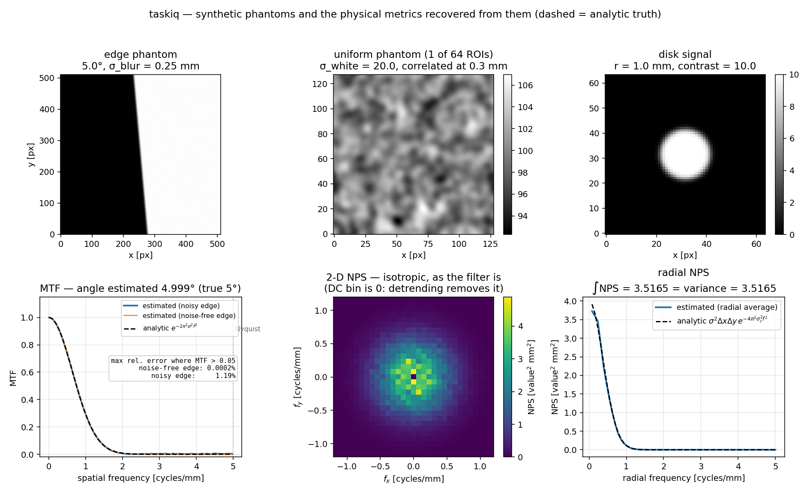
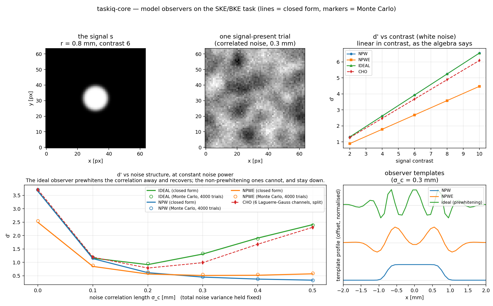
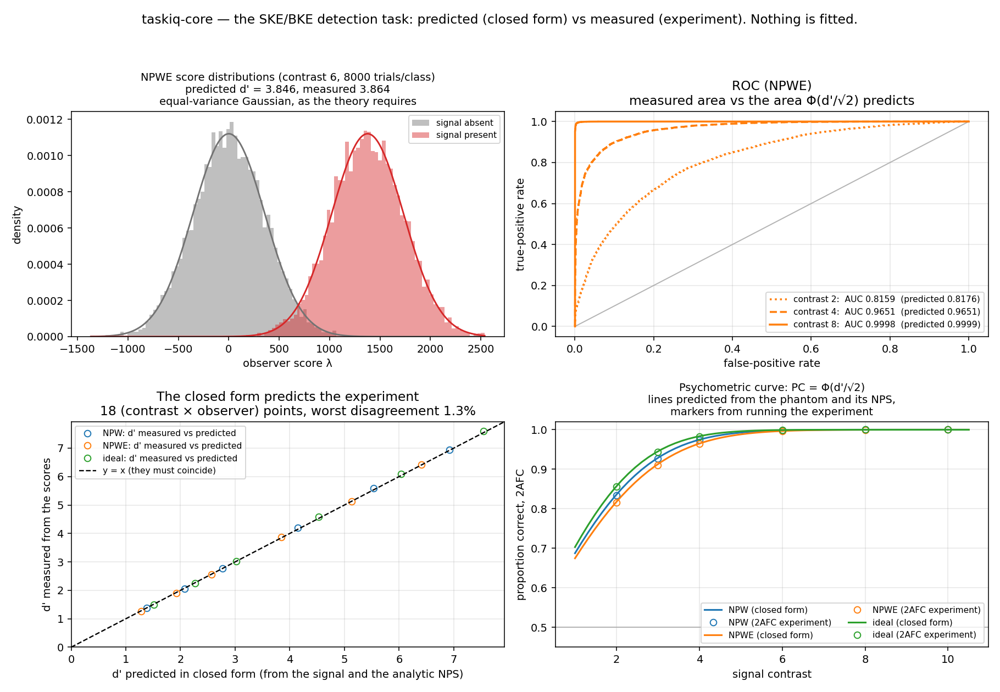

# taskiq-core

**Task-based image quality on synthetic phantoms.** Measure physical image quality
(MTF, NPS, and later NEQ) and task performance (model-observer *d′* / AUC) on the *same*
synthetic images, through the same pipeline, so that the transfer from **physical metrics
to task performance** can be quantified as acquisition conditions are swept.

Everything is synthetic and analytic. No DICOM, no patient data, no deep learning — the
runtime dependencies are numpy, scipy, scikit-image and matplotlib.

> **Status: increment 3 of N.** Phantoms, the physical metrics (MTF, NPS), the model
> observers (NPWE, the ideal prewhitening observer, CHO) and the detection task itself
> (SKE/BKE trials, *d′*, AUC, ROC, 2AFC) are implemented and validated end to end.
> `atlas.py` (condition sweeps, NEQ, physical→task regression) is a documented stub — see
> the roadmap below.

An interactive GUI workbench lives in a **separate repository**,
[**taskiq-studio**](https://github.com/Institute-of-One/taskiq-studio) — see [below](#gui-workbench).

---

## The one idea that shapes this codebase

**Every estimator is validated against a closed-form answer, not against itself.**

A snapshot test tells you the code still does what it did last week; it cannot tell you
that what it did was *right*. So each phantom here is built to have an analytically known
truth, and each estimator is required to recover it:

| Estimator | Analytic ground truth | Measured agreement |
|---|---|---|
| `mtf_from_edge` | Edge is the *exact* erf profile of a Gaussian-blurred step, so its presampled MTF is exactly exp(−2π²σ²f²) | **≤ 0.004 %** relative error (requirement: < 1 %), over 15 combinations of blur and edge angle |
| `nps_2d` | White noise → NPS flat at σ²ΔxΔy; Gaussian-correlated noise → σ²ΔxΔy·exp(−4π²σ_c²f²) | Every radial bin within its own statistical error bar |
| `nps_2d` normalisation | ∬NPS du dv = σ² is an *exact* identity, not an approximation | **~2 × 10⁻¹⁶** (machine precision) |
| `npwe` (no eye filter) | In white noise, *d′* = ‖s‖₂/σ — an exact identity that ties the NPS normalisation directly to *d′* | **~1 × 10⁻¹⁶** (machine precision) |
| `npwe`, `ideal_linear` | Closed-form *d′* vs the empirical *d′* on 20 000 simulated trials — two independent computations | within the Monte-Carlo standard error |
| `cho` | *d′*² = (Us)ᵀ(σ²UUᵀ)⁻¹(Us) in white noise | within the Monte-Carlo standard error |
| `two_afc`, `auc_from_scores`, `pc_from_d_prime` | PC = AUC = Φ(*d′*/√2), by three routes that share no code | agree to < 0.005 |
| the whole pipeline | phantom → analytic NPS → observer's closed-form *d′* → scored trials → measured *d′* and 2AFC | **≤ 1.3 %** over 18 contrast × observer experiments |

That discipline is the whole point, and it keeps paying. Six bugs found so far — every one
of them returns a *plausible* number, and not one would have been caught by a test that
compared the code against its own past output.

**In the physical metrics:**

1. **Bin-position jitter.** The mean sample position inside an ESF bin is not the bin
   centre — where the projected samples pile up depends on the edge angle. Treating the
   bin average as a sample *at* the centre biased the MTF by **1.4 %** at some angles and
   not at others. Correcting each bin from its measured mean position to the bin centre
   cut the error to 0.002 %.
2. **The estimator's own filters.** Bin averaging is a boxcar (`sinc(f·h)`); a central
   difference is not a derivative (`sinc(2f·h)`). Both are divided out analytically.
3. **A soft-edged disk that gained area.** Applying the 1-D erf profile of a blurred
   *straight* edge radially — the obvious shortcut — adds πσ² of area, so the signal's
   energy would silently depend on its blur, and that error would propagate straight into
   *d′*. The exact 2-D Gaussian-blurred disk (a non-central χ² CDF) conserves it.

**In the observers** — each found by pitting the closed form against a simulation:

4. **A prewhitening observer cannot use a noise model whose power decays to nothing.**
   Weighting by 1/NPS makes the *least* noisy frequencies dominate, so a Gaussian-correlated
   NPS (which falls ~70 orders of magnitude across the frequency plane) gives an ideal-observer
   *d′* of order **10²⁹** — assembled entirely from bins where the noise has underflowed and
   the "signal" is floating-point rounding. Nothing about the number looks wrong. Real noise
   has a floor; `ideal_linear` now refuses an NPS without one.
5. **A measured NPS has a zeroed DC bin,** because `nps_2d` detrends. Zero-NPS bins
   contribute no noise variance, so *d′* comes out **~3 % high** for a disk — whose DC bin
   carries ~6 % of the observer's noise weight. An eye filter has E(0) = 0 and is immune,
   which is exactly the distinction the guard makes rather than blanket-refusing measured
   spectra.
6. **Laguerre-Gauss channels are only orthonormal if they fit inside the image.** At the
   width that seemed natural, channel 5 retained **81 %** of its norm and the Gram matrix was
   off the identity by 0.25 — "orthonormal channels" that were not orthonormal, which nothing
   downstream would ever have caught.

All six are now covered by tests that fail if the fix is removed.

## Also load-bearing

- **Determinism.** Same `seed` → bit-identical images, checked as `bytes` equality of the
  raw buffers, from the phantom all the way through to the estimated MTF and NPS.
- **No silent failure.** Degenerate input raises `ValueError` with an actionable message.
  An ESF window too narrow for the blur, an underpopulated ESF bin, an axis-aligned
  "slanted" edge, noise requested without a seed, a NaN anywhere — each is an error, not a
  quietly wrong number. The estimators would rather refuse than mislead.
- **Noise robustness where it matters.** The edge-angle estimator is linear in the pixel
  values, so image noise adds variance but no bias. The obvious alternative — a centroid
  of the rectified gradient `|∇I|` — reports a 5° edge as **0.6°** at 2 % noise, and half a
  degree of angle error smears the ESF by more than the blur being measured.
- **Statistical estimates say which way they are biased.** A CHO's *d′* from
  resubstitution is biased **high** (the template is scored on its own training data); from
  a train/test split it is biased **low** (the template really was trained on half the
  data). Neither is "the" answer, so `cho` documents both and the test suite checks that
  they *bracket* the asymptotic value rather than pretending either is unbiased.

---

## Install

```bash
git clone https://github.com/Institute-of-One/taskiq-core
cd taskiq-core
pip install -e .          # or: pip install -r requirements.txt
```

Python ≥ 3.10.

## Use

```python
from taskiq_core import make_edge_phantom, mtf_from_edge, gaussian_mtf

# A slanted edge, blurred analytically: its true MTF is known in closed form.
edge = make_edge_phantom(512, spacing=0.1, contrast=1000.0,
                         angle_deg=5.0, blur_sigma_mm=0.25)

mtf = mtf_from_edge(edge.image, edge.spacing)   # edge angle estimated from the image
truth = gaussian_mtf(mtf.frequency, 0.25)       # exp(-2 pi^2 sigma^2 f^2)

print(mtf.angle_deg)                            # 5.0000...
print(abs(mtf.mtf - truth).max())               # 2.4e-06
```

```python
from taskiq_core import make_uniform_phantom, nps_2d

rois = make_uniform_phantom(64, spacing=0.1, mean=100.0, noise_sd=20.0,
                            seed=0, n_realizations=64)
nps = nps_2d(rois.image, rois.spacing)

nps.frequency, nps.nps_radial      # radial NPS [cycles/mm], [value^2 mm^2]
nps.integral, nps.variance         # equal, by construction
```

```python
from taskiq_core import make_disk_signal, npwe, ideal_linear, burgess_eye_filter

signal = make_disk_signal(64, radius_mm=0.8, contrast=6.0, spacing=0.1)
white_nps = 20.0**2 * 0.1**2                      # sigma^2 * dx * dy

npw = npwe(signal.image, white_nps, 0.1)          # no eye filter
print(npw.d_prime)                                # == ||s||/sigma, exactly
print(npw.auc)                                    # Phi(d'/sqrt(2))

eye = burgess_eye_filter(peak_cycles_per_mm=1.0)
human_ish = npwe(signal.image, white_nps, 0.1, eye_filter=eye)
bound = ideal_linear(signal.image, white_nps, 0.1)
print((human_ish.d_prime / bound.d_prime) ** 2)   # efficiency vs the ideal observer
```

The whole pipeline, end to end — predict the experiment, then run it:

```python
from taskiq_core import (make_disk_signal, ske_bke_trials, npwe, burgess_eye_filter,
                         score_images, d_prime_from_scores, two_afc, pc_from_d_prime)

signal = make_disk_signal(64, radius_mm=0.8, contrast=6.0, spacing=0.1).image

# An SKE/BKE experiment, carrying the *analytic* NPS of the noise it just generated.
trials = ske_bke_trials(signal, n_trials=8000, spacing=0.1, noise_sd=20.0, seed=0,
                        correlation_sigma_mm=0.25, white_floor_sd=8.0)

# Predict d' in closed form — from the signal and the NPS, never touching the images.
obs = npwe(trials.signal, trials.nps, trials.spacing, eye_filter=burgess_eye_filter(1.0))
print(obs.d_prime)                                  # 4.296  (predicted)

# Now actually run it.
present = score_images(trials.present, obs.template)
absent  = score_images(trials.absent,  obs.template)
print(d_prime_from_scores(present, absent))         # 4.268  (measured)
print(two_afc(present, absent))                     # 0.9988 (measured PC)
print(pc_from_d_prime(obs.d_prime))                 # 0.9988 (predicted PC)
```

Run the test suite and regenerate the figures:

```bash
python -m pytest -q           # 161 passed
python examples/overview.py   # -> examples/output/overview.png
python examples/observers.py  # -> examples/output/observers.png
python examples/detection.py  # -> examples/output/detection.png
```





## GUI workbench

An interactive companion app, **taskiq-studio**, lives in its own repository:

> **https://github.com/Institute-of-One/taskiq-studio**

It lets you explore all of this with the parameters under your fingers — the measured MTF/NPS
beside their analytic truth, each observer's predicted *d′* beside its measured one, and
condition sweeps. It is a separate application that only *calls* this library (no new
dependency; it uses `tkinter`), so it can never disagree with the core without that being a
bug in the studio.

```bash
pip install -e path/to/taskiq-core     # this library, first
pip install -e path/to/taskiq-studio   # then the GUI
taskiq-studio                          # or:  python -m taskiq_studio
```

## Documentation

- **[`paper/paper.md`](paper/paper.md)** — a JOSS-style manuscript describing the software,
  its motivation, and the closed-form-validation method.
- **[`docs/REPRODUCE.md`](docs/REPRODUCE.md)** — a development log and reproduction guide:
  how the project was built, increment by increment, with an AI coding assistant, and how to
  reproduce every number and figure from a clean checkout.

## API

| Module | Contents |
|---|---|
| `taskiq_core.phantoms` | `make_edge_phantom` (slanted edge, analytic Gaussian blur), `make_uniform_phantom` (white or Gaussian-correlated noise), `make_disk_signal` (low-contrast disk), `Phantom` |
| `taskiq_core.physical` | `mtf_from_edge` (ESF→LSF→MTF), `nps_2d` (2-D + radial NPS), `estimate_edge_angle`, `gaussian_mtf` (the analytic reference), `MTFResult`, `NPSResult` |
| `taskiq_core.tasks` | `ske_bke_trials` (a trial set that carries the analytic NPS of its own noise), `d_prime_from_scores`, `auc_from_scores`, `roc_curve`, `two_afc`, `pc_from_d_prime` / `d_prime_from_pc`, `TrialSet`, `ROCResult` |
| `taskiq_core.observers` | `npwe` (non-prewhitening ± eye filter), `ideal_linear` (prewhitening matched filter — the upper bound), `cho` (channelized Hotelling), `burgess_eye_filter`, `laguerre_gauss_channels` / `dense_dog_channels` / `gabor_channels`, `score_images` |
| `taskiq_core.atlas` | *planned* — condition sweeps, NEQ, physical→task regression |

Results are frozen dataclasses carrying the estimate, the intermediate quantities (ESF,
LSF, bin counts; observer templates, channel covariance), and a `meta` record of the
settings used.

### Conventions

- Images are `float32`, indexed `image[row, col]` = `image[y, x]`.
- `spacing` is the isotropic pixel pitch in **mm**; frequencies are **cycles/mm**.
- `angle_deg` is the angle of the edge **normal** from the +x axis, so 0° is a vertical
  edge. It must not be axis-aligned.
- NPS is in `value² mm²`, normalised so that ∬NPS du dv = σ².
- Observer templates and channels are applied as plain pixel sums, so their overall scale
  cancels in *d′*.
- Randomness flows only through `numpy.random.default_rng(seed)`.

## Roadmap

1. ~~Phantoms + physical metrics (MTF, NPS), validated against analytic truth.~~
2. ~~`observers.py` — NPWE, the ideal prewhitening observer, and CHO, each held to a closed
   form and to Monte Carlo.~~
3. ~~`tasks.py` — SKE/BKE trial generation, ROC and 2AFC, tested against `PC = Φ(d′/√2)`
   and against the closed-form *d′* end to end.~~ ← **you are here**
4. `atlas.py` — NEQ, condition sweeps, and the physical→task transfer the study is about.

## Citing

See [`CITATION.cff`](CITATION.cff) and [`paper/paper.md`](paper/paper.md). A Zenodo DOI
will be minted at the first tagged release.

## License

MIT — see [`LICENSE`](LICENSE).
