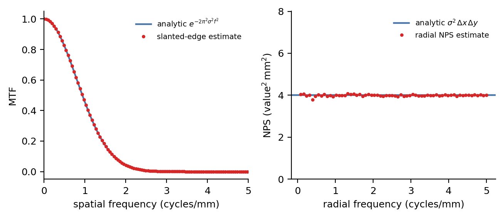
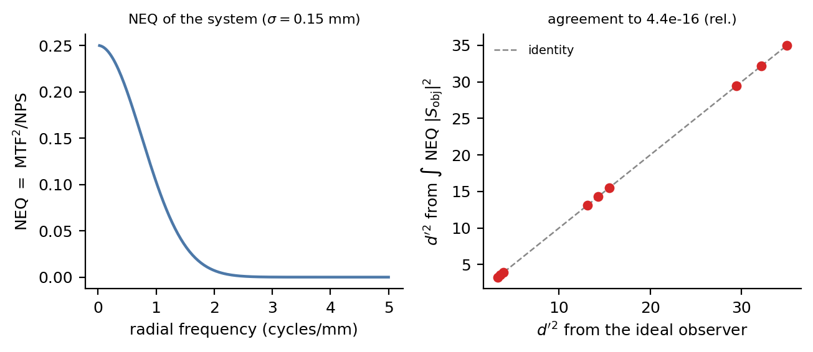
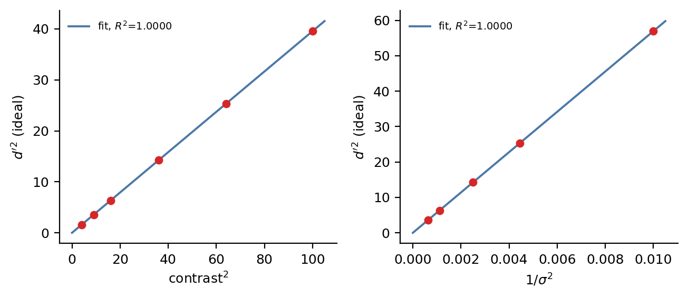
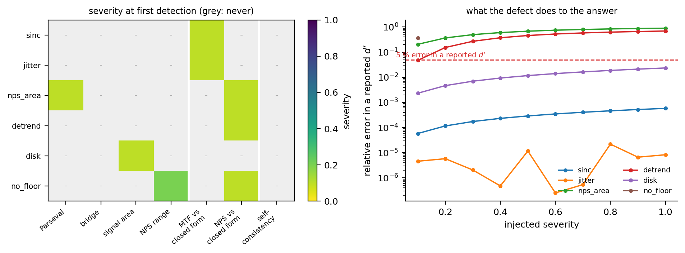
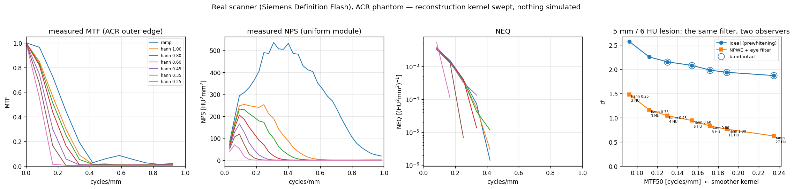

<!--
Prepared for submission to *Journal of Imaging* (MDPI, ISSN 2313-433X).
Article type: Article. Structure follows the MDPI Instructions for Authors
(Introduction / Materials and Methods / Results / Discussion / Conclusions,
followed by the required MDPI back-matter declarations).
At submission, paste into the official MDPI Word template (jimaging-template.dot)
or submit as free-format (all required sections are present).
-->

**Type:** Article

**Title:** Error Injection in Task-Based Image Quality Pipelines: What Regression Testing Cannot Catch, and Why Neither Internal Identities nor Closed-Form References Suffice Alone

**Author:** Shuji Yamamoto $^{1,*}$

$^{1}$ Institute of One, LISIT Co., Ltd., Tokyo 150-0044, Japan; yamamoto@lisit.jp; ORCID 0000-0001-9211-1071

$^{*}$ Correspondence: yamamoto@lisit.jp

---

## Abstract

Task-based image quality assessment — the modulation transfer function, the noise power spectrum, the noise-equivalent quanta and model observers — fails by returning a plausible wrong number rather than an error, and the regression test most implementations carry cannot tell a plausible right answer from a plausible wrong one, because the stored reference was recorded from the defective code. We injected six defects into a validated implementation of that chain through a severity dial that recovers the correct pipeline exactly at zero. A self-consistency regression test detected none of the six. Four internal identities, which need no ground truth, and two closed-form references, which need a phantom whose answer is known, together detected all six, in every case at or before the severity at which the reported detectability index $d'$ became wrong by more than 5%. Neither family sufficed alone: each detected three of six, and peak errors in a reported $d'$ reached 90%. Run unmodified on measured ACR phantom projections across seven reconstruction kernels, the three identities that can be evaluated without ground truth transferred intact — Parseval held to $4\times10^{-16}$ — but their tolerances did not, and the strongest apodisation drove the noise dynamic range to within 0.6% of the threshold beyond which a prewhitening observer must refuse to answer.

## Keywords

task-based image quality; model observer; MTF; NPS; NEQ; detectability; error injection; implementation error; quality assurance; closed-form validation

---

## 1. Introduction

Task-based assessment — judging an imaging system by how well a specified observer performs a specified detection or discrimination task, rather than by a generic fidelity metric — is the accepted framework for evaluating medical imaging systems [1,2]. Its physical ingredients are individually standardised: the modulation transfer function (MTF), classically measured from a slanted edge by the presampled-MTF method formalised in ISO 12233 [3], and the noise power spectrum (NPS) and detective-quantum-efficiency formalism standardised for digital X-ray detectors in IEC 62220-1 [4]. Its observer theory is mature [1,5,7,8], its relation to dose and patient risk has been set out in detail [11], its practice from physical measurement through to model observers has been reviewed for CT [12], and its use in computed tomography has been consolidated in AAPM Task Group 233 [9]. The quantity tying the physics to the task is the noise-equivalent quanta, $\mathrm{NEQ} = \mathrm{MTF}^2/\mathrm{NPS}$, because the ideal-observer detectability of a known signal imaged through a linear system is exactly an integral of NEQ against the signal's power spectrum.

The theory is settled. The implementations are not, and this paper is about the gap between them. The object of study is therefore the chain itself — any implementation of it — rather than a particular program: each defect examined below is a step the standard formulation requires, applied to one instance so that its cost can be measured, and the checks proposed against them are stated so that they can be asserted inside any implementation.

### 1.1 The characteristic failure is a plausible number

A pipeline assembling this chain fails in a specific and inconvenient way. It does not crash, and it does not return an obviously absurd value. It returns a number of the right order of magnitude, with the right units, moving in the right direction when the dose is changed — and wrong.

Three concrete examples, all found in the pipeline studied here during its development:

* A slanted-edge MTF routine locates each edge-profile sample in the bin it falls into, but uses the bin *centre* as its position. The mean sample position inside a bin is not the bin centre, and the resulting position jitter biases the estimate. The bias depends on the edge angle, so it is invisible to anyone who tests at one angle.
* A prewhitening observer weights by $1/\mathrm{NPS}$. Handed a noise model whose power decays below floating-point underflow, it returns a detectability of order $10^{29}$, assembled entirely from frequency bins where the "signal" is rounding error.
* A soft-edged disk phantom, blurred by applying a one-dimensional edge profile radially rather than by an exact two-dimensional convolution, gains $\pi\sigma^2$ of area. The detectable signal energy then depends on the blur without any indication that it does, so every conclusion drawn about resolution is contaminated by a change in the signal itself.

None of these announce themselves. Each produces a number a reviewer would accept.

### 1.2 What a regression test can and cannot establish

The standard defence is a regression test: run the pipeline, store the output, and fail the build if the output ever changes. This is a genuinely useful discipline — it catches accidental change, and it makes refactoring safe. It also cannot, in principle, catch any of the three defects above.

The reason is structural rather than incidental. If a defect was present when the reference output was recorded — which is the normal case for a defect that was never noticed — then the stored value *is* the defective value. The pipeline is deterministic, so it reproduces that value exactly, and the test passes. A regression test establishes that the code is stable. Stability and correctness are different properties, and the reproducibility apparatus of computational science largely certifies the first [13]: an analysis that re-runs to the same answer has been shown to be deterministic, not to be right. That software defects reach published results, and are rarely found by the practices meant to prevent them, is documented across fields [14,15].

What can catch such defects is a check whose reference comes from outside the code. Two kinds are available, and the distinction between them turns out to matter:

* **Internal identities** must hold for algebraic reasons, whatever the data. That the integral of the NPS over the frequency plane equals the pixel variance is not an empirical fact about a particular phantom; it is Parseval's theorem. Identities of this kind need no ground truth, and therefore continue to work on measured patient data where no truth exists.
* **Closed-form references** compare an estimate to the analytic answer for an object constructed so that the answer is known: an analytically blurred edge whose presampled MTF is exactly $\exp(-2\pi^2\sigma^2 f^2)$, or white noise of known variance whose spectrum is exactly $\sigma^2\,\Delta x\,\Delta y$. These are stronger, and they require a phantom.

Whether the second kind is worth its cost — whether a synthetic phantom earns its place in a workflow whose object is real images — is an empirical question that this paper answers.

### 1.3 Contributions

1. A controlled **injection study**: six defects, each dialled by a severity that recovers the correct pipeline exactly at zero, evaluated against a self-consistency regression test and six checks, with the severity of first detection compared against the severity at which the reported $d'$ first becomes materially wrong.
2. The finding that the two check families are **complementary and individually insufficient**, and in particular that half of these defects are undetectable without a phantom of known truth.
3. Two **corrected magnitudes** for defects previously reported only qualitatively: the angular structure of the bin-centre jitter bias, and the dependence of the omitted-sinc bias on a free implementation parameter.
4. A demonstration that the same chain, unmodified, reproduces the required behaviour on **measured projections from a clinical scanner** across a seven-point reconstruction-kernel sweep.

## 2. Materials and Methods

### 2.1 The pipeline under test

All experiments use one pure-Python implementation of the chain (`taskiq-core`), which computes the slanted-edge MTF, the two-dimensional and radially averaged NPS, the unnormalised $\mathrm{NEQ} = \mathrm{MTF}^2/\mathrm{NPS}$, and model-observer detectability. Observers are the non-prewhitening matched filter with an optional eye filter (NPW/NPWE) [6], the prewhitening matched filter, which coincides with the ideal linear observer for stationary Gaussian noise, and the channelised Hotelling observer [5]. Task performance is summarised by $d'$, the area under the ROC curve computed distribution-free from the Mann–Whitney statistic, and two-alternative-forced-choice percent correct.

The MTF estimator forms the edge-spread function, differentiates to the line-spread function, and transforms, analytically dividing out the two transfer functions the estimator itself introduces: the bin-average boxcar, $\mathrm{sinc}(fh)$, and the central-difference derivative, $\mathrm{sinc}(2fh)$, where $h$ is the ESF bin width. It additionally corrects each bin from its measured mean sample position to the bin centre. The NPS estimator detrends each region of interest and normalises so that the integral of the NPS over the frequency plane equals the pixel variance as an exact identity.

Unless stated otherwise the reference configuration is: pixel pitch $\Delta x = 0.1$ mm, system blur $\sigma = 0.15$ mm, a $256 \times 256$ edge phantom at 5°, a $64 \times 64$ noise region over 64 realisations at noise standard deviation 20 units, and a disk signal of radius 0.8 mm and contrast 6 units. The reference pipeline returns $d' = 3.5745$ from the prewhitening observer and $d' = 3.5719$ through the NEQ route.

### 2.2 The checks

Six checks were implemented, four internal identities and two closed-form references (Table 1). Each returns a scalar violation magnitude; a check *fires* when that magnitude exceeds its tolerance.

**Table 1.** The six checks, their family, and the tolerance each is held to. Tolerances are set from the estimator's measured reproducibility on a correct pipeline, with an order of magnitude of margin.

| key | check | family | tolerance |
|---|---|---|---|
| `parseval` | $\int \mathrm{NPS}\,df$ = pixel variance | identity | $10^{-9}$ |
| `bridge` | NEQ integral = prewhitening $d'$ | identity | $10^{-9}$ |
| `signal_area` | signal integral = contrast $\times \pi r^2$ | identity | $10^{-6}$ |
| `dynamic_range` | $\max(\mathrm{NPS})/\min(\mathrm{NPS}) < 10^{6}$ | identity | — |
| `mtf_closed_form` | MTF = $\exp(-2\pi^2\sigma^2f^2)$ | closed form | $5\times10^{-5}$ |
| `nps_closed_form` | NPS = $\sigma^2\,\Delta x\,\Delta y$ | closed form | $0.25$ |

Tolerances are not chosen for convenience. Each is set from the estimator's own measured reproducibility on the correct pipeline, with an order of magnitude of margin: the residual of `mtf_closed_form` on a correct run is $4.9\times10^{-6}$, so its tolerance is $5\times10^{-5}$; the residual of `nps_closed_form` is $3.6\times10^{-2}$ against a tolerance of $0.25$; `parseval` and `bridge` hold to $2.2\times10^{-16}$ and exactly zero respectively. A tolerance set tighter than the estimator's reproducibility produces a check that fires on correct code, which is not a sensitive guard but a broken one — a failure mode we encountered and discuss in Section 4.6.

Two points deserve emphasis. First, `bridge` compares two routes to the same number — the prewhitening observer applied to the imaged signal, and the integral of NEQ against the object's power spectrum — that share no code path but are, under the discrete conventions used here, the same integral rearranged. It is therefore an exact identity rather than an approximation, and holds to zero on the reference pipeline. It is only an identity when both routes use the same noise model; comparing routes that disagree about the noise tests nothing but that disagreement. Second, `dynamic_range` excludes the DC bin, which mean-detrending drives to $\sim10^{-31}$ by construction. That is bookkeeping, not a decayed spectrum, and reading it as one causes the check to fire on every field including white noise.

### 2.3 The self-consistency control

The control is the test most implementations actually have. The pipeline is run at a given severity, its output recorded, and the pipeline re-run and compared to that record. Critically, the record is taken from the pipeline *as it stands*, with the defect already present — the realistic case for a defect that was never noticed. The pipeline is deterministic, so the comparison is exact by construction. Reporting this as a result rather than asserting it is deliberate: it is the quantitative form of the argument in Section 1.2.

### 2.4 The six defects

Each defect is applied to the correct pipeline through a severity $\alpha \in [0,1]$ constructed so that $\alpha = 0$ recovers the correct pipeline exactly. Nothing is rewritten to break it; the defect is injected from outside the library.

1. **`sinc`** — the bin-average and central-difference transfer functions left in the MTF estimate, at severity $\alpha$: $\mathrm{MTF}_\alpha = \mathrm{MTF} \cdot [\mathrm{sinc}(fh)\,\mathrm{sinc}(2fh)]^{\alpha}$. Evaluated at an ESF bin of $\Delta x/4$.
2. **`jitter`** — the bin-centre correction omitted, with severity indexing the edge angle over eleven values from 2° to 20°.
3. **`nps_area`** — the pixel-area factor dropped from the NPS normalisation by a fraction $\alpha$: $\mathrm{NPS}_\alpha = \mathrm{NPS}\cdot(\Delta x\,\Delta y)^{-\alpha}$.
4. **`detrend`** — ROI detrending switched off over a background ramp of amplitude $60\alpha$ units.
5. **`disk`** — the signal built by interpolating between the exact two-dimensional blurred disk and the one obtained by applying the one-dimensional edge profile radially.
6. **`no_floor`** — the prewhitening observer handed a measured spectrum with noise correlation length $0.5\alpha$ mm and no floor.

Defects 2, 5 and 6 are the three found in this pipeline during development; 1, 3 and 4 are standard failure modes of the same chain.

### 2.5 Detection and materiality

For each defect the *detection severity* is the smallest $\alpha$ at which any check fires, and the *material severity* is the smallest $\alpha > 0$ at which the reported $d'$ — taken as the worse of the prewhitening and NEQ routes — differs from that defect's own $\alpha = 0$ value by more than 5%. Measuring against the defect's own zero rather than a global reference removes confounds: the `jitter` sweep varies the edge angle, which changes the estimate slightly even when the correction is applied.

A check that fires only after the answer is already wrong is not a guard, so the comparison of these two severities, and not the mere fact of detection, is the endpoint.

### 2.6 The real-scanner arm

To establish that the chain behaves as required outside a synthetic model, the same code was run on measured ACR phantom projections from LDCT-and-Projection-data [10]. The ACR accreditation phantom is an established vehicle for measuring MTF and NPS on a clinical scanner [16], which is why it was chosen (The Cancer Imaging Archive, CC BY 4.0). Nothing about the acquisition is simulated: one set of measured projections was reconstructed seven times with progressively stronger apodisation — a bare ramp, then Hann windows at cutoffs 1.00, 0.80, 0.60, 0.45, 0.35 and 0.25 — which moves the MTF and the NPS together exactly as changing a scanner's reconstruction kernel does. The MTF, NPS, NEQ and model-observer detectabilities were then read off with the same estimators used throughout.

### 2.7 Use of generative AI

Code scaffolding and refactoring, test drafting, figure and script generation, and
manuscript drafting were assisted by a large language model (Claude, Anthropic). The
author independently re-executed every numerical result reported here and verified all
figures, equations and claims against the code. No AI system is an author.

## 3. Results

### 3.1 The pipeline is correct where a closed form can reach it

Before injecting anything, the estimators were held to their analytic answers. The slanted-edge MTF matched $\exp(-2\pi^2\sigma^2f^2)$ to a maximum relative error of **0.004%** (Figure 1) across fifteen blur-by-angle combinations (blur 0.15–0.35 mm, angles 3–15°). Integrating the estimated two-dimensional NPS over the frequency plane recovered the input variance to **0.029%** over 128 realisations — a sampling error, not a bias — with the underlying Parseval identity verified to $6.7\times10^{-5}$ in absolute residual and to $10^{-10}$ relative in the test suite. The NEQ route and the prewhitening observer agreed to $4.4\times10^{-16}$ across nine contrast-by-blur conditions (Figure 2). On swept data (Figure 3), $d'^2$ was linear in contrast$^2$ and in inverse noise variance with coefficients of determination numerically equal to 1, and the NPWE observer's efficiency relative to the ideal observer was constant across contrast to a spread of $3.4\times10^{-9}$.

{width=90%}

**Figure 1.** The physical estimators held to their closed forms. Left: the slanted-edge MTF estimate (points) against the analytic Gaussian $\exp(-2\pi^2\sigma^2f^2)$ (line) for an edge of blur 0.2 mm. Right: the radially averaged NPS estimate (points) against the analytic white level $\sigma^2\,\Delta x\,\Delta y$ (line) for noise of standard deviation 20 units.

{width=90%}

**Figure 2.** The physics-to-task bridge. Left: the $\mathrm{NEQ} = \mathrm{MTF}^2/\mathrm{NPS}$ of the system. Right: $d'^2$ from the prewhitening observer (horizontal) against $d'^2$ from integrating NEQ against the object power spectrum (vertical), over nine contrast-by-blur conditions; the points lie on the identity line to machine precision.

{width=90%}

**Figure 3.** The transfer laws recovered from swept data. Left: ideal-observer $d'^2$ against contrast$^2$. Right: $d'^2$ against inverse noise variance. Both through-origin fits return a coefficient of determination indistinguishable from 1.

These establish that the pipeline is correct in the region a closed form can reach. They are the precondition for the injection study, not its result.

### 3.2 Which check catches which defect

Table 2 and Figure 4 give the outcome. No check fires at $\alpha = 0$ for any defect.

**Table 2.** Six injected defects against seven checks. Detection severity is the smallest $\alpha$ at which a check fires; material severity is the smallest at which the reported $d'$ is wrong by more than 5%. The seventh check, the self-consistency regression test, fired on none of the six and so appears nowhere in the *caught by* column.

| defect | origin | caught by | detection $\alpha$ | material $\alpha$ | worst error in $d'$ |
|---|---|---|---|---|---|
| `sinc` | standard | MTF closed form | 0.1 | never | 0.06% |
| `jitter` | found here | MTF closed form | 0.1 | never | 0.002% |
| `nps_area` | standard | **Parseval**, NPS closed form | 0.1 | 0.1 | 90.0% |
| `detrend` | standard | NPS closed form | 0.1 | 0.2 | 69.4% |
| `disk` | found here | **signal area** | 0.1 | never | 2.4% |
| `no_floor` | found here | **NPS dynamic range**, NPS closed form | 0.1 | 0.1 | 37.0% |

{width=100%}

**Figure 4.** What each check sees. Left: the injected severity at which each check first fires, grey where it never does; the rightmost column is the self-consistency regression test, grey for every defect. The white rules separate internal identities (left) from closed-form references (centre) and from the regression control (right). Right: the relative error each defect produces in a reported $d'$, against the 5% materiality threshold (dashed).

Every defect was caught, and every defect was caught at or before the severity at which it corrupted the answer. Three of the six never made $d'$ materially wrong at any severity tried, and were nonetheless detected at the first severity step — which is the desired asymmetry: the checks are more sensitive than the endpoint they protect.

### 3.3 The regression test catches nothing

The self-consistency control disagreed with itself by at most $0.0$ — exactly zero, at every severity of every defect. It caught **0 of 6**.

This is not a subtle result and it is not a criticism of any particular codebase. It follows from determinism: the snapshot was recorded from the defective pipeline, so the defective pipeline reproduces it. Any project whose validation consists of comparing today's output to yesterday's has, with respect to defects of this class, no validation at all.

### 3.4 Neither family of check is sufficient

The two families split the defects cleanly:

* **Internal identities** caught `nps_area` (Parseval), `disk` (conserved signal area) and `no_floor` (NPS dynamic range) — **3 of 6**.
* **Closed-form references** caught `sinc`, `jitter` and `detrend` — **3 of 6**.

No defect was caught only by a check outside its family, and no single check caught more than two defects. The `bridge` identity, which is the most theoretically satisfying of the six and holds to machine precision, caught none of these defects at all: it is insensitive to any error shared by both of its routes.

The practical consequence is the paper's main claim. Internal identities are the checks that survive contact with measured data, because they need no truth; they are what remains available when the object of study is a patient image. They catch half of these defects. The other half — an MTF biased by its own estimator, an NPS whose level is wrong — are detectable only against an object whose answer is known in advance. Removing the synthetic phantom from a validated workflow does not merely reduce coverage; it removes an entire failure class from view.

### 3.5 Two magnitudes, measured

Two defects previously described only qualitatively were quantified, and both descriptions needed revision.

**The jitter bias spikes; it does not drift.** Sweeping the edge angle from 2° to 20° in 0.5° steps with the bin-centre correction disabled, the maximum absolute MTF error over the band $f \le 3$ cycles/mm was $3.2\times10^{-3}$ at 5.0° but only $8.4\times10^{-5}$ at 4.5° and $2.8\times10^{-4}$ at 5.5° — a factor of thirty-eight between neighbouring half-degree steps. The worst case over the whole range is 0.32%, not the 1.4% previously reported for this estimator, and the more important correction is structural: the bias is not a smooth function of angle that one could bound by testing the endpoints. It spikes where the sampling geometry becomes commensurate. With the correction applied the same sweep stays below $5\times10^{-6}$ throughout.

**The sinc bias is set by a free parameter.** The magnitude of an omitted $\mathrm{sinc}(fh)\,\mathrm{sinc}(2fh)$ deconvolution depends entirely on the ESF bin width $h$, which is an implementation choice rather than a property of the imaging system. Over the same band the deficit is 16.7% at $h = \Delta x/2$, 4.3% at $\Delta x/4$, 0.70% at $\Delta x/10$ and 0.18% at $\Delta x/20$. A statement that neglecting these corrections costs "a few percent" is therefore incomplete without the binning: two implementations with the same bug can differ by two orders of magnitude in how much it costs them.

### 3.6 Three ways to make a check lie

The study as first written reported that every defect was detected at severity zero — an apparently excellent result, and entirely an artefact. Three independent causes were responsible, each of which produced output that read as a finding:

1. The DC bin of a mean-detrended NPS sits at $\sim10^{-31}$ by construction. Read as a decayed noise spectrum, it gives a dynamic range of $2\times10^{31}$ and fires the dynamic-range check on every field, white noise included.
2. The `bridge` check compared a prewhitening observer using a measured spectrum against an NEQ route using an analytic scalar. The two disagree by $7.7\times10^{-3}$ for reasons that have nothing to do with any defect.
3. The `mtf_closed_form` tolerance was initially set at $2\times10^{-3}$, loose enough to miss the uncorrected jitter bias at 15° ($6.5\times10^{-5}$); tightening it below the estimator's own reproducibility of $4.9\times10^{-6}$ would instead have made it fire on correct code.

These are recorded because they are the same class of failure the paper is about, occurring one level up: a validation apparatus can return plausible wrong answers exactly as a pipeline can. The regression tests accompanying this study therefore assert the two properties that make it meaningful — that no check fires on a correct pipeline, and that the self-consistency control never fires — rather than asserting the study's conclusions.

### 3.7 The same chain on a real scanner

Run without modification on measured ACR phantom projections, the chain behaved as the theory requires across all seven reconstruction kernels (Table 3, Figure 5).

**Table 3.** MTF → NPS → NEQ → detectability on measured projections, sweeping apodisation. Nothing is simulated; the same projections are reconstructed seven ways.

| kernel | MTF$_{50}$ (mm$^{-1}$) | noise SD | NEQ peak | $d'$ ideal | NPWE efficiency |
|---|---|---|---|---|---|
| ramp | 0.235 | 27.34 | 0.00352 | 1.868 | 0.111 |
| Hann 1.00 | 0.188 | 10.69 | 0.00320 | 1.935 | 0.155 |
| Hann 0.80 | 0.172 | 8.12 | 0.00326 | 1.979 | 0.174 |
| Hann 0.60 | 0.154 | 5.56 | 0.00355 | 2.078 | 0.205 |
| Hann 0.45 | 0.130 | 3.75 | 0.00360 | 2.149 | 0.233 |
| Hann 0.35 | 0.112 | 2.65 | 0.00389 | 2.252 | 0.266 |
| Hann 0.25 | 0.092 | 1.61 | 0.00534 | 2.572 | 0.331 |

{width=95%}

**Figure 5.** The same chain on measured ACR phantom projections, with the reconstruction kernel swept from a bare ramp through Hann apodisation at cutoffs 1.00 to 0.25. Nothing about the acquisition is simulated; the same projections are reconstructed seven ways.

Strengthening the apodisation reduces resolution and noise together, as it must. Ideal-observer detectability rises monotonically from 1.87 to 2.57 across the sweep: for this low-contrast task the noise reduction outweighs the resolution loss throughout the range tested. The efficiency of the non-prewhitening eye-filter observer relative to the ideal observer rises threefold over the same sweep, from 0.111 to 0.331 — the inefficient observer benefits from smoothing far more than the efficient one does, because smoothing performs part of the noise-weighting the inefficient observer cannot perform for itself.

The regression of $d'^2_{\text{ideal}}$ on the NEQ integral returns $R^2 = 0.84$ here, against a coefficient numerically equal to 1 on synthetic data. The gap is instructive: at the two strongest apodisations the measured MTF band has collapsed to 0.25 and 0.17 mm$^{-1}$, so the NEQ integral is taken over a truncated band and no longer summarises the same quantity. Over the five kernels whose measured band is intact the NEQ integral varies by a coefficient of variation of 4.9% and $d'_{\text{ideal}}$ by 5.0%, while the noise standard deviation varies by a factor of 7.3.

### 3.8 Which checks survive the move to measured data

Three of the four internal identities were run on all seven real-scanner reconstructions (Table 4). The fourth, `bridge`, is absent for a reason specific to measured data rather than by omission: it compares a prewhitening observer using the measured noise spectrum against an NEQ route that requires an analytic noise scalar, and on a physical scanner those two routes no longer share a noise model. What it then measures is that disagreement, not the correctness of the pipeline, and Section 4.6 gives the residual it produces. The claim of transfer in this paper is therefore made for three identities, not four.

**Table 4.** Internal identities evaluated on measured ACR phantom data. Three of the four appear here. The two closed-form references cannot: neither the true MTF nor the true NPS of a clinical scanner is known analytically. The fourth identity, `bridge`, cannot either, because its two routes stop sharing a noise model once the noise is measured rather than specified (Sections 3.8 and 4.6).

| kernel | Parseval residual | NPS dynamic range | signal-area residual |
|---|---|---|---|
| ramp | $4.4\times10^{-16}$ | $3.1\times10^{3}$ | $4.7\times10^{-3}$ |
| Hann 1.00 | $2.2\times10^{-16}$ | $1.6\times10^{4}$ | $4.7\times10^{-3}$ |
| Hann 0.80 | $4.4\times10^{-16}$ | $2.9\times10^{4}$ | $4.7\times10^{-3}$ |
| Hann 0.60 | $4.4\times10^{-16}$ | $1.0\times10^{5}$ | $4.7\times10^{-3}$ |
| Hann 0.45 | $2.2\times10^{-16}$ | $2.9\times10^{5}$ | $4.7\times10^{-3}$ |
| Hann 0.35 | $2.2\times10^{-16}$ | $6.6\times10^{5}$ | $4.7\times10^{-3}$ |
| Hann 0.25 | $4.4\times10^{-16}$ | $\mathbf{9.9\times10^{5}}$ | $4.7\times10^{-3}$ |

Three things follow, and the third was not anticipated.

**Parseval survives intact.** The identity holds to $4.4\times10^{-16}$ — machine precision — on measured projections, exactly as on synthetic data. This is the property that makes internal identities worth having: nothing about the transition from a generated phantom to a physical one weakens them, because they never depended on knowing the answer.

**Tolerances do not survive intact.** The signal-area residual is $4.7\times10^{-3}$ throughout, four orders of magnitude above the $10^{-6}$ that the same identity achieves on synthetic data, and constant across every kernel — which identifies its source as the discretisation of the disk rather than anything the reconstruction does. An identity transfers to measured data; the tolerance it should be held to does not, and must be re-derived from the discretisation actually in use.

**A clinically ordinary reconstruction comes within 0.6% of tripping the guard.** The NPS dynamic range rises monotonically with apodisation, from $3.1\times10^{3}$ at a bare ramp to $9.9\times10^{5}$ at Hann 0.25 — against the $10^{6}$ threshold beyond which a prewhitening observer is refused. The strongest smoothing tested, which is not an exotic setting, leaves the spectrum a factor of 1.006 short of the point at which the software declines to compute a detectability at all. The margin protecting a real study from the $d' \approx 10^{29}$ failure mode of Section 1.1 is therefore not comfortable, and it narrows in exactly the direction that low-dose protocols push reconstruction. This is a guard that will fire in practice, and an implementation without one will instead return a number.

## 4. Discussion

### 4.1 What this implies for reported studies

The uncomfortable corollary of Section 3.3 is that a large fraction of published model-observer work carries no evidence bearing on the class of defect studied here. Reviews of task-based practice in CT describe the estimators and the observers in detail and say little about how an implementation of them is shown to be correct [12], and the wider evidence on software defects in published science suggests that silence is not because the problem is absent [14,15]. The usual reproducibility apparatus — a fixed seed, a pinned environment, a stored expected output, code released on request — establishes that a result can be regenerated. None of it establishes that the result was right the first time. A defect present at first publication is reproduced faithfully by every subsequent re-run, and released code makes the reproduction easier rather than the error more visible.

We do not claim that published detectability values are commonly wrong; we have not surveyed them and this study cannot support such a claim. What it does support is narrower and still uncomfortable: for six defects of a kind that occur in practice, the standard apparatus provides zero detection power, and the errors they produce in a reported $d'$ reach 90%.

### 4.2 A checklist

The four internal identities are cheap, need no phantom, and can be asserted inside any implementation of this chain:

1. $\int \mathrm{NPS}(f)\,df$ equals the pixel variance of the data the NPS was estimated from, to floating-point tolerance.
2. Ideal-observer $d'$ computed through NEQ equals $d'$ computed by the prewhitening observer, when both use the same noise model.
3. The integral of a blurred signal equals the integral of the unblurred signal.
4. The NPS dynamic range, excluding DC, stays within the range where $1/\mathrm{NPS}$ is meaningful; a prewhitening observer should refuse rather than return a number when it does not. Section 3.8 shows this is not a theoretical precaution: strong apodisation on a real scanner approaches the threshold closely enough that the check decides real cases.

The two closed-form references require a phantom and catch what the identities cannot:

5. The presampled MTF of an analytically blurred edge equals $\exp(-2\pi^2\sigma^2f^2)$.
6. The NPS of white noise of known variance equals $\sigma^2\,\Delta x\,\Delta y$.

The injection study adds two methodological items to these six. Check 5 must be evaluated over a *sweep* of edge angles, not one, because the bias it detects is not monotone in angle and can be an order of magnitude larger between two angles half a degree apart. And every tolerance must be set from the estimator's measured reproducibility in the configuration actually in use: too loose and it misses the defect, too tight and it fires on correct code, and the correct value differs by four orders of magnitude between synthetic and measured data for the same identity.

### 4.3 Relation to previous work

Standards documents [3,4] and task-group reports [9] specify what to measure and how, and are the appropriate reference for the definitions used here. They do not, and are not intended to, specify how an implementation should establish that it has implemented them correctly. Model-observer methodology reviews [8] treat the estimation of observer performance from data, largely under the assumption that the physical inputs are correct. The present study concerns the layer between: the correctness of the implementation itself, treated as an empirical question with a measurable answer.

The closest methodological relatives are outside imaging — mutation testing in software engineering, which measures a test suite by injecting faults and counting those it detects [17]. The adaptation here is that the "tests" are physical identities rather than assertions about program state, and that the endpoint is a physical quantity ($d'$) rather than test-suite coverage, so that detection can be dated against the point at which the science, not the code, goes wrong.

### 4.4 Limitations

The injected defects are six, chosen because three had actually occurred and three are standard; they are not a random sample of the space of possible defects, and the detection rates should not be read as an estimate of coverage against defects in general. The severity dial is a construction: real defects are present or absent rather than continuous, and severity here stands in for the free parameters (edge angle, bin width, ramp amplitude, correlation length) that determine how much a present defect costs. The material-error threshold of 5% is a convention.

The pipeline is a linear-systems idealisation: shift-invariant imaging, stationary noise, Gaussian blur, and a signal- and background-known-exactly task, which is the most tractable and least clinically realistic paradigm. The real-scanner arm demonstrates that the chain runs and behaves correctly on measured projections; it is not a validation against a physical standard, since the true MTF and NPS of that scanner are unknown — which is the point of Section 3.4 rather than an oversight. The channelised Hotelling observer has no closed form and is not part of the analytic sweep.

Finally, the study validates a pipeline against identities that the same author selected. An identity that no one thought to assert protects nothing, and the four here are certainly not exhaustive.

## 5. Conclusion

A task-based image quality pipeline that passes its own regression suite has demonstrated stability, not correctness, and for the class of defect studied here the distinction is total: self-consistency caught none of six injected defects, while closed-form and identity-based checks caught all six, in every case at or before the point where the reported detectability became materially wrong. The two families of check are complementary and neither suffices alone. Half the defects are detectable using identities that need no ground truth and therefore travel to patient data; the other half are invisible without a phantom whose answer is known in closed form. A workflow that discards the phantom once it moves to real images does not lose a little sensitivity — it loses an entire class of error, permanently and without indication.

## Author Contributions

S.Y. is the sole author and is responsible for conceptualization, methodology, software,
validation, formal analysis, investigation, data curation, visualization, and writing —
original draft and review and editing. The author has read and agreed to the published
version of the manuscript.

## Funding

This research received no external funding. Computing resources and author time were
supported in kind by LISIT Co., Ltd. and TexelCraft OU.

## Institutional Review Board Statement

Not applicable. This study involved no human participants and no animal subjects. The
only measured data are of a physical quality-assurance phantom, obtained from a public
archive under an open licence.

## Informed Consent Statement

Not applicable.

## Data Availability Statement

All code — the phantom generators, the physical and observer estimators, the injection
study (`paper/make_injection_study.py`) and the test suite — is openly available at
<https://github.com/Institute-of-One/taskiq-core> under the MIT licence and archived on
Zenodo (version DOI [10.5281/zenodo.21422924](https://doi.org/10.5281/zenodo.21422924) for v0.4.0, the archived snapshot behind every number here; concept DOI 10.5281/zenodo.21422923 resolves to the latest version).
Every number in this article is written to `paper/figures/injection.json` and
`paper/results/acr_atlas.json` by the scripts that produce the figures, so the text and
the figures cannot diverge. The real-scanner projections are the ACR_Phantom series of
LDCT-and-Projection-data [10], available from The Cancer Imaging Archive under CC BY 4.0.

## Acknowledgments

Generative AI (Claude, Anthropic) was used as a tool for code scaffolding, test drafting,
figure generation and manuscript drafting, as disclosed in Section 2.7. The author is
solely accountable for the content and independently verified every result. No AI system
is an author. This disclosure follows ICMJE and COPE guidance.

## Conflicts of Interest

S.Y. is the Representative Director (CEO) of LISIT Co., Ltd. and Chief Executive Officer
of TexelCraft OU. Institute of One is the open-research initiative of LISIT Co., Ltd.,
which provides institutional oversight for this work. These commercial relationships are
disclosed as potential competing interests. The work used no client or patient data and
presents openly licensed research software. The author declares no other conflict of
interest. The funders had no role in the design of the study; in the collection,
analyses, or interpretation of data; in the writing of the manuscript; or in the decision
to publish the results.

## References

1. Barrett HH, Myers KJ. *Foundations of Image Science.* Hoboken, NJ: Wiley-Interscience; 2004.
2. International Commission on Radiation Units and Measurements. Medical Imaging — The Assessment of Image Quality. *ICRU Report 54.* Bethesda, MD: ICRU; 1996.
3. International Organization for Standardization. Photography — Electronic still picture imaging — Resolution and spatial frequency responses. *ISO 12233:2017.* Geneva: ISO; 2017.
4. International Electrotechnical Commission. Medical electrical equipment — Characteristics of digital X-ray imaging devices — Part 1-1: Determination of the detective quantum efficiency. *IEC 62220-1-1:2015.* Geneva: IEC; 2015.
5. Myers KJ, Barrett HH. Addition of a channel mechanism to the ideal-observer model. *J Opt Soc Am A.* 1987;4(12):2447–2457. doi:10.1364/JOSAA.4.002447.
6. Burgess AE. Statistically defined backgrounds: performance of a modified nonprewhitening observer model. *J Opt Soc Am A.* 1994;11(4):1237–1242. doi:10.1364/JOSAA.11.001237.
7. Barrett HH, Yao J, Rolland JP, Myers KJ. Model observers for assessment of image quality. *Proc Natl Acad Sci USA.* 1993;90(21):9758–9765. doi:10.1073/pnas.90.21.9758.
8. He X, Park S. Model observers in medical imaging research. *Theranostics.* 2013;3(10):774–786. doi:10.7150/thno.5138.
9. Samei E, Bakalyar D, Boedeker K, et al. Performance evaluation of computed tomography systems: Summary of AAPM Task Group 233. *Med Phys.* 2019;46(11). doi:10.1002/mp.13763.
10. Moen TR, Chen B, Holmes DR III, et al. Low-dose CT image and projection dataset. *Med Phys.* 2021;48(2):902–911. doi:10.1002/mp.14594.
11. Barrett HH, Myers KJ, Hoeschen C, Kupinski MA, Little MP. Task-based measures of image quality and their relation to radiation dose and patient risk. *Phys Med Biol.* 2015;60(2):R1–R75. doi:10.1088/0031-9155/60/2/R1.
12. Verdun FR, Racine D, Ott JG, et al. Image quality in CT: From physical measurements to model observers. *Phys Med.* 2015;31(8):823–843. doi:10.1016/j.ejmp.2015.08.007.
13. Peng RD. Reproducible research in computational science. *Science.* 2011;334(6060):1226–1227. doi:10.1126/science.1213847.
14. Soergel DAW. Rampant software errors may undermine scientific results. *F1000Research.* 2015;3:303. doi:10.12688/f1000research.5930.2.
15. Merali Z. Computational science: ...Error. *Nature.* 2010;467(7317):775–777. doi:10.1038/467775a.
16. Friedman SN, Fung GSK, Siewerdsen JH, et al. A simple approach to measure computed tomography (CT) modulation transfer function (MTF) and noise-power spectrum (NPS) using the American College of Radiology (ACR) accreditation phantom. *Med Phys.* 2013;40(5):051907. doi:10.1118/1.4800795.
17. Jia Y, Harman M. An analysis and survey of the development of mutation testing. *IEEE Trans Softw Eng.* 2011;37(5):649–678. doi:10.1109/TSE.2010.62.
